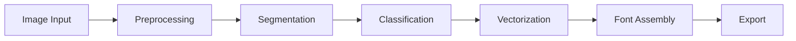
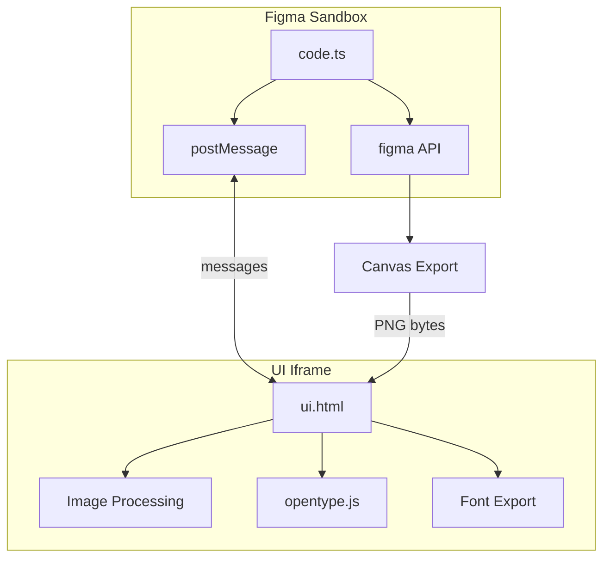
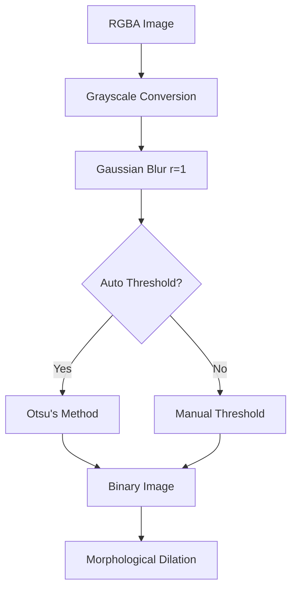
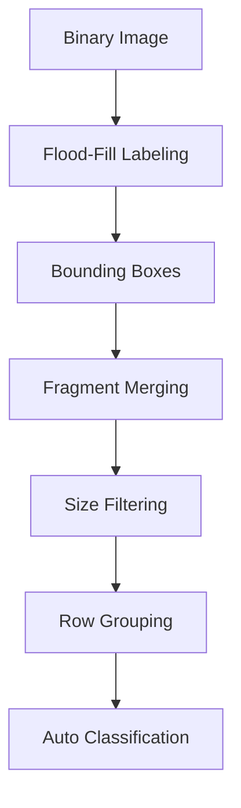
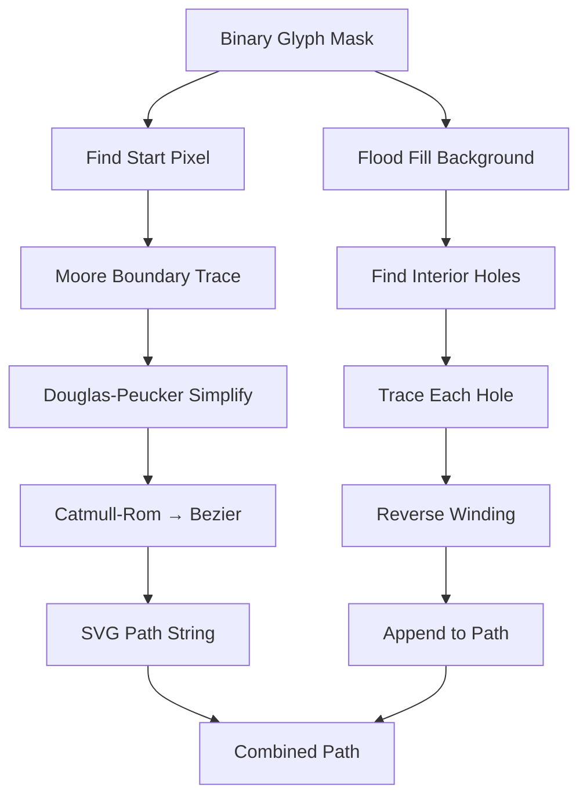
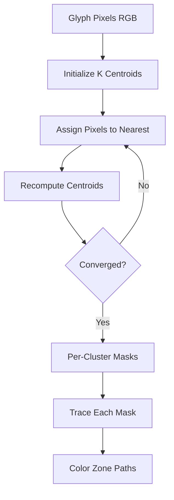
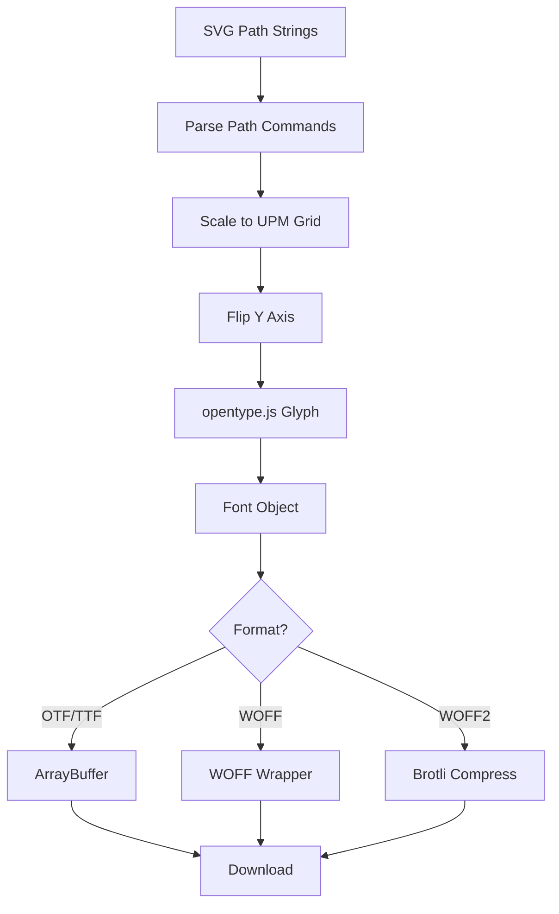
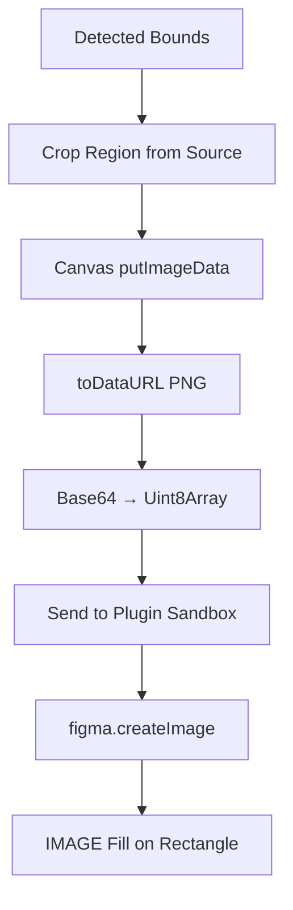
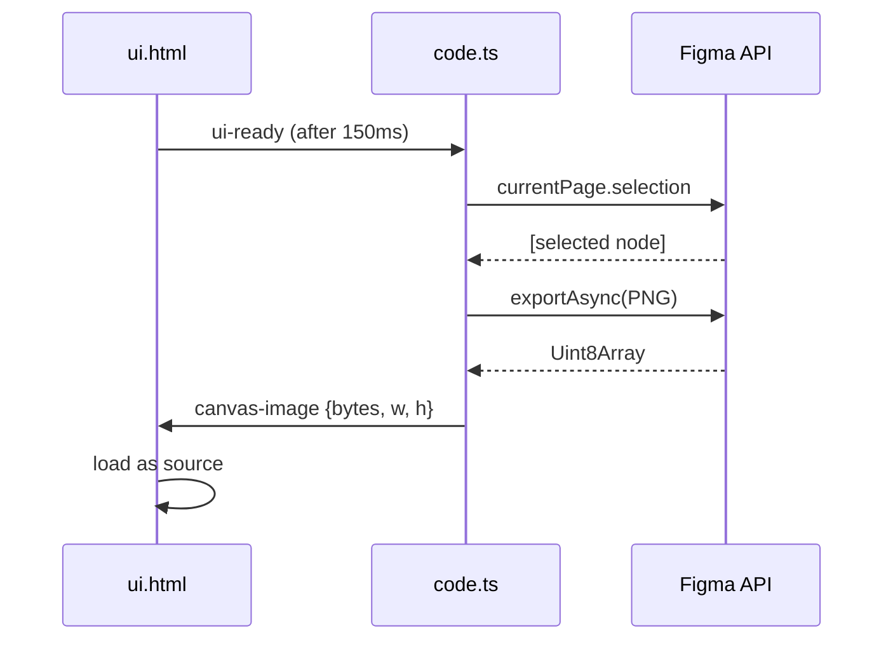

# under the hood

technical deep-dive into how fontasy fork processes images into fonts.

## architecture overview

the pipeline has two parallel architectures:
- **figma plugin**: sandbox (`code.ts`) handles figma API calls, UI iframe (`ui.html`) handles all image processing
- **web app**: single `index.html` with the same processing pipeline, outputs font files directly

## plugin architecture

the plugin uses figma's standard architecture:
- `code.ts` runs in figma's sandbox with access to the plugin API (creating nodes, reading selections, exporting)
- `ui.html` runs in a sandboxed iframe with full browser APIs (canvas, file APIs, web workers)
- communication is via `postMessage` / `onmessage`

## image preprocessing

### grayscale conversion
uses luminance weights: `0.299R + 0.587G + 0.114B` (ITU-R BT.601 standard)

### gaussian blur
applied with radius=1 before thresholding to reduce noise. uses separable 1D convolution (horizontal pass then vertical pass) for O(n·r) instead of O(n·r²).

the kernel is computed as: `k[i] = exp(-(i-r)² / (2 · 0.36 · r²))`

### otsu's method
finds the optimal threshold by maximizing inter-class variance between foreground and background.

algorithm:
1. compute histogram (256 bins)
2. for each possible threshold t:
   - compute weight and mean of background class (pixels < t)
   - compute weight and mean of foreground class (pixels >= t)
   - compute between-class variance: `σ² = wB · wF · (μB - μF)²`
3. return t that maximizes σ²

### binary dilation
3×3 structuring element. if any neighbor of a background pixel is foreground, it becomes foreground. this bridges tiny gaps between stroke fragments.

## connected component labeling

uses iterative flood-fill (stack-based, not recursive) to label connected regions. each pixel gets a component ID.

### fragment merging
uses union-find (path compression + union by rank) to merge components whose bounding boxes are within `mergeDistance` pixels of each other.

this handles:
- the dot on `i` and `j`
- broken strokes from light pen pressure
- diacritical marks
- multi-part symbols

### row grouping
groups glyphs into rows by comparing their vertical midpoints. tolerance = 0.5 × average glyph height. within each row, glyphs are sorted left-to-right by x-coordinate.

### auto-classification (alphabetic mode)
assigns character labels based on the expected 9-row layout:
- rows 0-1: punctuation
- row 2: digits
- rows 3-5: uppercase A-Z
- rows 6-8: lowercase a-z

each row maps up to 9 characters from the CHAR_ORDER constant.

## contour tracing

### moore boundary tracing
walks the boundary of a binary shape using 8-connectivity directions. starts from the topmost-leftmost foreground pixel and follows the contour clockwise until returning to the start.

direction order: N, NE, E, SE, S, SW, W, NW (encoded as dx/dy pairs)

for each step:
1. turn 135° right from incoming direction
2. scan counterclockwise until a foreground pixel is found
3. move to that pixel, record it
4. repeat until back at start

### douglas-peucker simplification
reduces point count while preserving shape. epsilon = 1.2 pixels.

algorithm:
1. draw line from first to last point
2. find the point with maximum perpendicular distance from that line
3. if distance > epsilon: recursively simplify each half
4. if distance <= epsilon: replace segment with just endpoints

### catmull-rom to cubic bezier
converts the simplified polygon to smooth cubic bezier curves using catmull-rom interpolation (tension = 0.3).

for each point p[i], control points are:
- cp1 = p[i] + (p[i+1] - p[i-1]) × t/3
- cp2 = p[i+1] - (p[i+2] - p[i]) × t/3

this produces smooth, organic curves that faithfully represent handwriting.

### hole detection

1. flood-fill from all border pixels to identify the "background" (reachable from edges)
2. any remaining unfilled white pixels are interior holes (counters)
3. trace each hole's boundary
4. reverse the winding direction (holes go counterclockwise in even-odd fill rule)
5. append hole paths to the main glyph path

this correctly handles letters like: o, p, d, b, q, 0, 8, @, #, %, &

## k-means color segmentation

when color mode is enabled:
1. extract RGB values of all foreground pixels in a glyph
2. initialize k centroids evenly spaced through the pixel array
3. iterate 12 times (fixed iteration count, no convergence check needed for this scale):
   - assign each pixel to nearest centroid (euclidean distance in RGB space)
   - recompute centroid as mean of assigned pixels
4. create a binary mask for each cluster
5. trace each mask using the same moore boundary → simplify → bezier pipeline
6. each zone gets the cluster's mean color

## font assembly

### coordinate transformation
svg paths use top-left origin (y increases downward). font glyphs use baseline origin (y increases upward).

transformation:
- scale: `min(600/glyphWidth, 1000/glyphHeight) × 0.75`
- x offset: center horizontally in 600-unit advance width
- y: flip with `ascender - (y × scale)`

### font metrics
- units per em: 1000
- ascender: 800
- descender: -200
- advance width: 600 (monospace)
- includes .notdef and space glyphs

### woff wrapping
manual binary construction of the WOFF1 header:
- magic: 0x774F4646 ("wOFF")
- sfVersion: copied from source OTF
- table directory: 20 bytes per table (tag, offset, compLength, origLength, checksum)
- table data: uncompressed (compLength = origLength)

WOFF2 requires brotli compression which isn't available in the browser sandbox, so it currently falls back to OTF.

## bead mode (raster path)

bead mode skips vectorization entirely. for each detected glyph:
1. crop the bounding box region from the source image data
2. render to a temporary canvas
3. export as PNG data URL
4. convert base64 to byte array
5. send bytes to the figma sandbox via postMessage
6. sandbox creates a Figma image from the bytes
7. places a rectangle with IMAGE fill type in the cell

this preserves the full visual appearance — shadows, textures, colors, rounded corners of physical beads.

## canvas selection detection

the ui-ready handshake solves a timing issue: if the sandbox tries to send the canvas image before the iframe is loaded, the message is lost. the 150ms delay ensures the UI message handler is registered before requesting the selection.

selection changes are also monitored via `figma.on('selectionchange')` for live updating.
